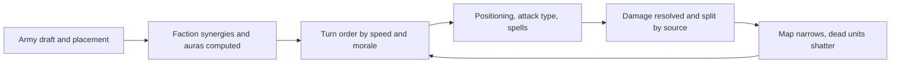

For a long time, "browser game" was shorthand for something shallow. A time killer, not a strategy game. We started Heroes of Crypto because we wanted the opposite: a turn-based tactics game with real army building, positioning, and spell play, that you can open in a browser tab and actually finish a match in.

That decision shaped almost every part of the project. It is why the whole battle engine runs client-side, why the client is open source, and why we measure every frame and every byte we ship.

This post is about the trade. What we gain by living in the browser, and what we pay for it.

## The case for the browser

The strongest argument is access. A player does not install anything, update anything, or own a particular console. They open a link. For a tactics game built around short, repeatable matches, that low floor matters more than a high ceiling. More people try it, more people come back, and the loop tightens.

There is a second argument that matters for an open project. When the game runs in a browser, the same code a developer reads on GitHub is the code that actually plays. There is no hidden server authoritatively simulating the match in a language nobody can inspect. The battle logic is right there, in TypeScript, in the open.

That transparency is not a marketing line. It is the reason balance discussions can reference real code paths instead of vibes.

## What it costs

The browser is a demanding host for a game that wants to feel responsive and look good.

Rendering is the obvious one. The classic Box2D-plus-WebGL client we shipped first worked, but it was hard to extend and expensive to animate. We are mid-migration to a PixiJS render layer precisely because the browser will not cut us slack on draw calls, sprite atlases, or frame pacing. The atlas decode for a single unit portrait can be tens of megabytes, and we had to build off-main-thread decode and a decode cache just so selecting a unit does not stutter.

State is the subtler cost. A tactics match has a lot of it: units, cells, auras, turn order, morale, luck, shrinking-map laps. Keeping all of that consistent, deterministic, and rewindable inside a single tab is a real engineering problem. We snapshot fight state before every attack so floating damage numbers can be split into the real hit, Fire Shield burns, and Petrifying Gaze kills, instead of lumping them into one confusing number.

Performance budgets are tight. Every spell hover preview, every active-unit aura, every death shatter is a choice to spend frames. We suppress the active-unit aura while a unit moves or attacks because two expensive animations at once is where the frame rate drops.

## Where it pays off

The browser also gives us things a native client would make painful.

| Concern | Native client | Browser |
| --- | --- | --- |
| First play | Install, trust, update | One link |
| Cross-platform | Build per platform | One build |
| Open logic | Possible but hidden by default | Same code players run |
| Patch delivery | Store review or updater | Deploy and reload |
| Iteration speed | Slow publish cycle | Ship daily if we want |

Read that table as a strategy, not a spec sheet. We are not claiming the browser is faster at runtime. We are claiming the browser is faster at the loop of play, read, fix, and ship. For a community-driven tactics game in beta, that loop is the product.

## The shape of a match

A match is not a single simulation. It is a sequence of discrete decisions, each of which can be inspected.

Caption: A fight is a loop of readable decisions, not a black-box auto-battle. Every arrow is something a player can see and react to.

What matters in that diagram is that none of those steps are hidden. Placement, synergy, turn order, and the narrowing map are all things a player can read on the board and plan against. The game is honest about why a fight was lost.

## What comes next

The browser-first bet is settled enough for us to keep making it. The remaining work is not about whether the game belongs in a browser. It is about making the in-browser experience feel like a finished game: multiplayer matchmaking, ranked ladders, and a render layer that finally looks as good as the tactics underneath.

If that sounds like the kind of project you want to watch or contribute to, the client is public. Read the code, file an issue, or just open the beta and lose a few matches while the balance is still rough. That is exactly the feedback we need.
