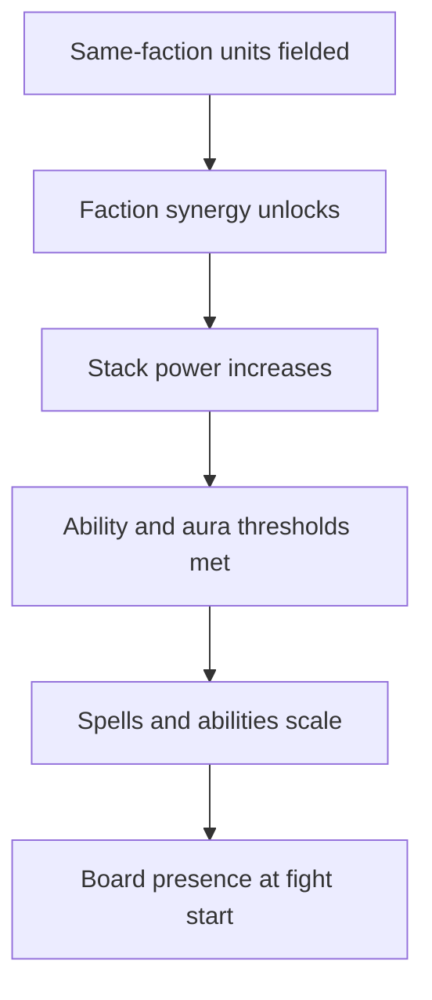

A roster of forty-six units across four factions sounds like the interesting part of army building. It is not. The interesting part is the synergy layer that sits on top of the roster, because it is what makes mono-faction and hybrid armies play completely differently.

If you have ever drafted an army that looked strong on paper and then lost before the first spell was cast, the synergy system is usually why. This post explains how it works and what it does to the draft.

## The core idea

Each faction, Chaos, Life, Might, and Nature, has a set of synergies. A synergy is a bonus that activates based on how many same-faction units you field. The more committed you are to a faction, the stronger the bonus. Field a mixed bag and you get none of it.

That single rule does a lot of work. It makes faction identity matter. It makes cutting a unit feel expensive. And it makes the late-draft decision between a strong off-faction unit and a weaker same-faction unit genuinely hard.

## How the bonuses stack

Synergies are not a flat multiplier. They are a family of effects that compound.

Caption: Faction commitment feeds a chain of thresholds. Fielding one more same-faction unit can flip several of them at once.

The thing to notice is the chain. Adding a unit is not just adding stats. It can push a stack over the threshold needed to cast a spell, or push an aura's range past the point where it covers the whole frontline. A draft is really a search for the configuration where several of those thresholds land on the same turn.

## What each faction asks of you

The factions are not reskins. They want different things from the board.

| Faction | Wants | Pays for it with |
| --- | --- | --- |
| Chaos | Aggression, early damage, board pressure | Fragility, weaker sustain |
| Life | Healing, morale, staying power | Slower kill speed |
| Might | Raw attack scaling, melee dominance | Vulnerable to magic and range |
| Nature | Auras, mobility, board control | Needs the right placements |

Read that as a draft constraint, not a balance verdict. A mono-chaos army commits to ending fights before the map narrows. A mono-life army commits to surviving long enough for morale and healing to compound. Neither is correct in the abstract. Each is a bet about how the match will play out.

## Why hybrid drafts are harder than they look

The temptation is to take the best unit from each faction. The cost is that you forfeit the synergy layer entirely. A hybrid army often has higher raw stats across the board and still loses, because the mono-faction army across from it is casting spells it cannot, covering cells its auras cannot reach, and surviving laps it cannot.

That is the design intent. We want faction commitment to be a real decision, not a flavor choice. If hybrid were strictly better, the synergy system would be decoration.

## Where it shows up in a fight

The draft is where synergies are chosen. The fight is where they are paid for.

A common loss pattern is a draft that clears every spell threshold but falls behind on positioning because the synergy bonuses pushed the army toward a frontline it cannot hold once the map starts shrinking. The synergy system did not lose the match. It made a commitment that the positioning layer then could not honor. Reading that distinction is most of getting better at the game.

## What we are still tuning

Synergy balance is the part of the game we adjust most often, because small number changes bend the draft hard. If one faction's threshold lands too easily, the meta collapses into it. If a threshold is too steep, that faction stops getting played at all.

The beta exists largely to find those edges. If you draft an army that feels obviously right or obviously wrong, that is the signal we need, and the client is public precisely so the balance conversation can be grounded in the real numbers instead of a feeling.
