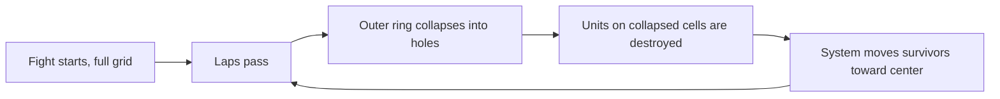

In most tactics games, the board is a constant. You learn the map, you take your time, and the geometry does not move. In Heroes of Crypto, the map shrinks. Every few laps the outer cells collapse into holes, and if a unit is standing on one, it dies.

That single mechanic changes the whole shape of a match. This post is about why we put it in the game and what it does to how you play.

## Why the map moves

Without pressure, a tactics match can stall. A player with a ranged advantage has every reason to kite, keep distance, and let the clock or the turn limit run. That is not fun to play and it is not fun to watch. The shrinking map exists to make stalling a losing strategy, not just a boring one.

Every few laps, a new ring of cells is consumed from the outside inward. The playable area gets smaller. The armies get closer. Eventually there is nowhere left to run, and the fight resolves.

## How it actually works

The narrowing is not random. It is a sequence.

Caption: The map is a one-way ratchet. Once a ring is gone, it is gone, and the survivors are pulled inward to keep the fight honest.

Two details matter. First, the collapse is destructive. A unit caught on a cell when it falls is removed from the fight. Second, survivors are moved toward the center so the remaining armies stay in contact. The map is not just getting smaller, it is forcing engagement.

## What it does to positioning

The shrinking map makes positioning a clock, not just a geometry problem.

| Situation | On a static map | On a shrinking map |
| --- | --- | --- |
| Ranged unit kiting | Strong, sustainable | A countdown to being cornered |
| Turtling in a corner | Safe indefinitely | The corner is the first thing to go |
| Slow melee army | Can be avoided forever | Will eventually reach you |
| Spreading out to dodge AOE | Free choice | Gets more expensive every lap |

Read the right column as the real game. A strategy that relies on space is a strategy with an expiration date. The map will take that space away.

## Why we move survivors inward

An earlier version of the game let survivors stay where they were after a ring collapsed. That produced a degenerate case: a unit could get pushed to the very edge, the edge would vanish, and the unit would be destroyed even though it had nowhere else to go. That felt unfair, because it was.

The fix was to pull survivors toward the center on each collapse. The map still shrinks, and standing on the edge is still dangerous, but a unit is never destroyed for the crime of having no legal cell to retreat to. The pressure is real, the punishment is not arbitrary.

## The armageddon finish

If a match runs long enough, the map narrows past a threshold and armageddon begins. Waves of damage hit every remaining unit, accelerating the end. This is the failsafe. Even if both armies somehow avoid each other, the game forces a resolution.

Armageddon is not a feature we expect most matches to reach. It exists so that a match cannot soft-lock. If you ever see it, something went sideways in the positioning war, and the game is closing the match out rather than letting it drift.

## What this means for how you play

The shrinking map rewards armies that can close distance and punish armies that depend on keeping it. It makes the center more valuable every lap. It turns the late game into a positioning puzzle where the safe cells are the ones that will still exist next lap.

If you are losing matches you felt in control of early, the map is usually the reason. You had space, you used it to stall, and the map took it away. The fix is to treat the board as something that is actively disappearing, and to fight on terms that get stronger as the space shrinks. That is the game we wanted to make, and so far it is the game people keep coming back to.
